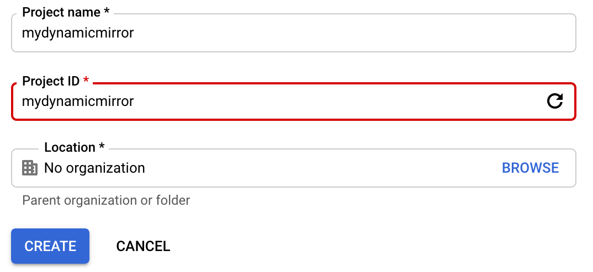
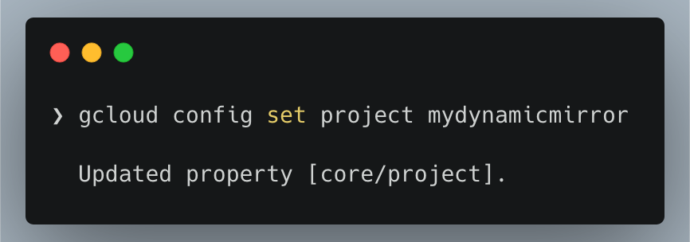
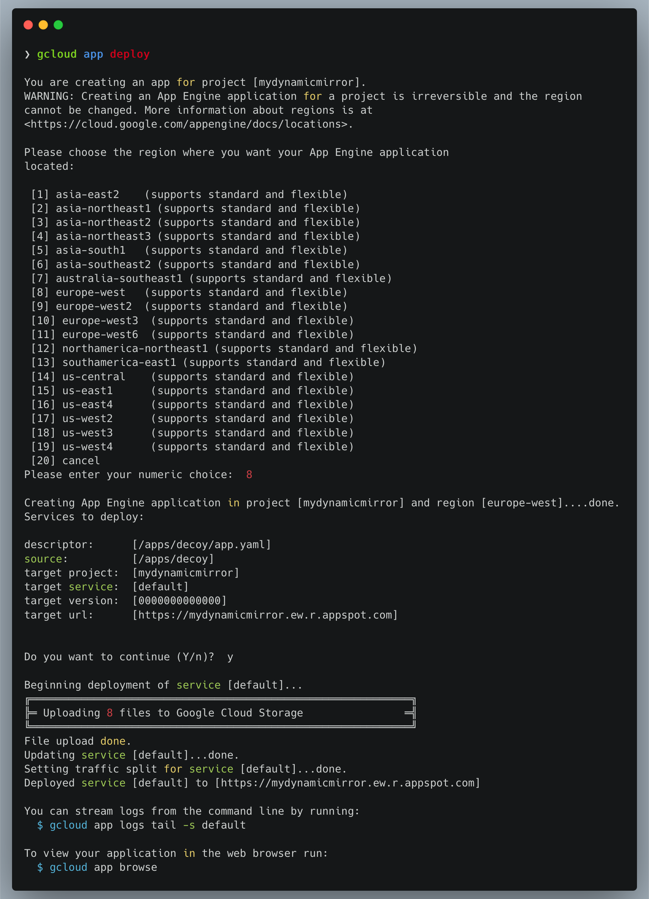
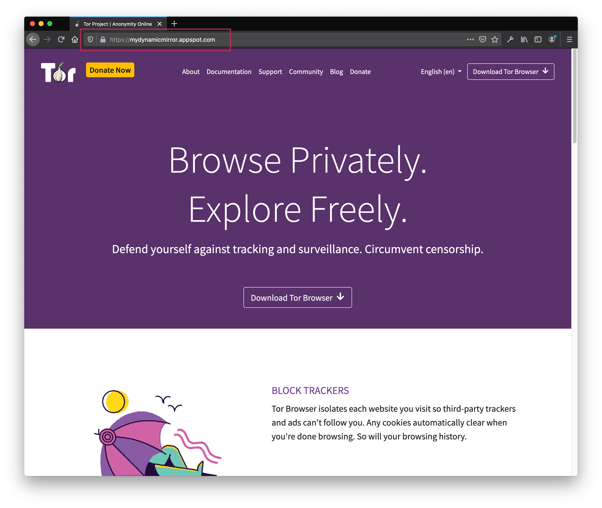

# Decoy

> Decoy is a reverse-proxy written in python and ready to deploy on Google App Engine platform. It can be configured to serve a specific website through App Engine.

The main advantage Decoy provides is the ability to serve the configured website through [GAE platform - Google App Engine](https://cloud.google.com/appengine), using a sub-domain under `*.appspot.com`.

**Decoy will proxy all URLs which contains the configured domain in `config.py` file automatically, any other URL will be opened normally without proxy.**

## Usage

1. Clone the project  `git clone https://github.com/icaruslab/decoy.git`

2. Create an account on [Google Cloud Platform](https://cloud.google.com/)
3. After accessing [Google Cloud Console](https://console.cloud.google.com/) create a new project

> The project name should be unique, if that's the case the project ID will be the same, other wise it will be assigned a random name. The project ID will be used to access your mirror, final URL will be `[ProjectID.appspot.com]`

4. Install [Google Cloud SDK](https://cloud.google.com/sdk/install)
5. Replace the `url` variable in `config.py` with your website domain name
6. Use your terminal to go the project's directory
7. Run `gcloud init` to configure GCloud SDK and login to your account.
8. Select the project you created earlier using `gcloud config set project [ProjectID]`

9.  Run `gcloud app deploy` and follow the instructions to deploy the app

10.  Finally you can confirm your mirror is running by visiting `[youprojectname].appspot.com`

## Why Google App Engine?

**The main advantage** of having the mirror traffic routed through GAE, is the ability to use a sub-domain under `appspot.com` to access the mirror.

As the same domain is associated with many other **Google cloud services** it'd be difficult to block it entirely.

However, **it's possible to block the sub-domain** without having to block the entire domain name, in which case you'll be able to get a new mirror up and running in less than two minutes by simply creating a new project with a different name and ID and repeating steps **8:10**

## Attribution

This project was inspired and built on [mirrorrr](https://github.com/bslatkin/mirrorrr) project.

## Disclaimer

This project and all Icarus Project’s related code and guides are developed for **the sole purpose of Internet censorship circumvention**, more specifically in human rights and independent media context.

**Icarus Project is not responsible for any abuse and/or malicious use of any of its published research results.**

## Todo

- [ ] Rewrite in Python3
